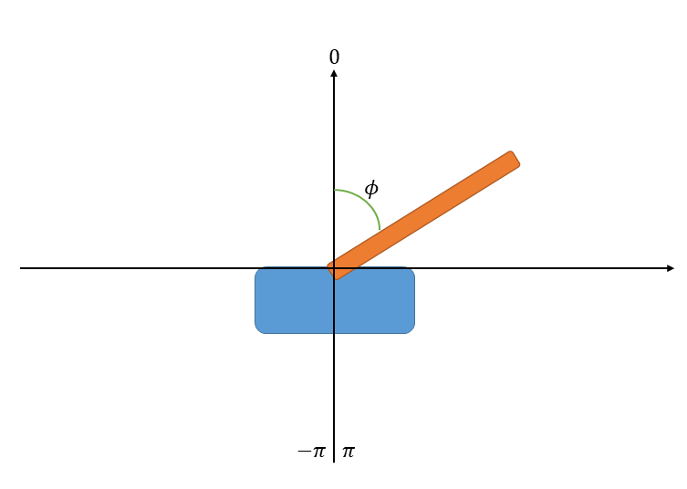

# LQR Control of First-Order Inverted Pendulum

## Folder Structure
```
├─env            # Gym env implementation of Inverted Pendulum
├─figures        # Saved images and result gif
│  G.txt         # Text file to save G
│  getGH.m       # MATLAB file to get G and H
│  H.txt         # Text file to save H
│  LQR.py        # LQR generalized implementation
│  README.md     # README
│  test_gym.py   # Run LQR in the Inverted Pendulum environment
│  utils.py      # Some public functions
```

## How to Run

To run the LQR controller for the inverted pendulum system:

1. Ensure you have Python installed on your system (Python 3.6 or higher is recommended).

2. Install the required dependencies:
   ```
   pip install numpy matplotlib gym
   ```

3. Navigate to the project directory in your terminal or command prompt.

4. Run the `test_gym.py` file:
   ```
   python test_gym.py
   ```

This will execute the LQR controller in the Inverted Pendulum environment and display the results.

## Establishing the Dynamic Equations

The simplified model of the first-order inverted pendulum system is shown in Figure 1. This model consists of a cart moving horizontally and a connected single pendulum. Some physical parameters are listed in the table below.

(Note: In the figure, $\theta$ is the angle between the pendulum and the vertical downward direction. In the code, `theta` represents the angle between the pendulum and the vertical upward direction, which is the same as $\phi$ in the following derivation. The pendulum mass is uniformly distributed, with the center of mass at the center of the pendulum.)

<p align="center">
  
  <br>
  <em>Figure 1: First-order inverted pendulum system model</em>
</p>

| Property | Value |
|----------|-------|
| Cart mass (M) | 0.5 kg |
| Cart damping (b) | 0.1 s$^{-1}$ |
| Pendulum mass (m) | 0.1 kg |
| Half-length of pendulum (l) | 0.3 m |
| Pendulum moment of inertia (I) | 0.012 kg*m$^2$ |
| Gravitational acceleration (g) | 9.8 m/s$^2$ |
| Sampling period (tau) | 0.005 s |

Dynamic equations for the pendulum and cart:

$$\begin{equation} 
(I+ml^2)\ddot{\theta}+mgl\sin \theta=-ml\ddot{x}\cos \theta 
\end{equation}$$

$$\begin{equation}
(M+m)\ddot{x}+b\dot{x}+ml\ddot{\theta}\cos \theta - ml\dot{\theta}^2\sin \theta = F 
\end{equation}$$

Where $\theta$ is the angle between the pendulum and the vertical downward direction, and $x$ is the displacement of the cart.

## Discretization of Dynamic Equations

The complete dynamic equations (1) and (2) are discretized and used as the state transition equations in the Gym simulation:

1. Calculate $\ddot{x}(k)$ and $\ddot{\theta}(k)$ at the current time step k:

$$
\begin{cases}
\ddot{\theta}(k)=(-g\sin\theta(k-1) - t\cos\theta(k-1)) / (\frac{I}{m} + l - \frac{ml\cos^2\theta(k-1)}{(M+m)})
\\
\ddot{x}(k)= t - \frac{ml\ddot{\theta}(k)\cos\theta(k-1)}{M+m}
\end{cases}
$$

Where $t=\frac{F(k) + ml[\dot{\theta}(k-1)]^2\sin\theta(k-1) - b\dot{x}(k-1)}{M+m}$

2. Calculate all state variables at the current time step:

$$
\begin{cases}
x(k)=x(k-1)+\Delta t\cdot\dot{x}(k-1)
\\
\dot{x}(k)=\dot{x}(k-1)+\Delta t\cdot \ddot{x}(k)
\\
\theta(k)=\theta(k-1)+\Delta t\cdot\dot{\theta}(k-1)
\\
\dot{\theta}(k)=\dot{\theta}(k-1)+\Delta t\cdot\ddot{\theta}(k)
\end{cases}
$$

## Important Notes for Gym Environment Implementation

1. Angle convention: In the equations, $\theta$ represents the angle between the pendulum and the vertical downward direction. In the program, `theta` represents the angle between the pendulum and the vertical upward direction. Adjust the calculation of $\ddot{\theta}(k)$ accordingly.

2. Angle wrapping: When using an incremental method to calculate `theta`, consider the discontinuity near $\pi$ (vertical downward position). The numerical values of `theta` (i.e., $\phi$ in the figure) correspond to positions as shown in Figure 2.

<p align="center">
  
  <br>
  <em>Figure 2: Angle position correspondence diagram</em>
</p>

Apply the following constraint to $\mathrm{theta}(k)$ to handle the discontinuity:

$$
\mathrm{theta}(k)=
\begin{cases}
\mathrm{theta}(k)-2\pi, & \mathrm{theta}(k-1) < \pi\ and\ \mathrm{theta}(k) \geq \pi
\\ 
\mathrm{theta}(k)+2\pi, & \mathrm{theta}(k-1) > -\pi\ and\ \mathrm{theta}(k) \leq -\pi
\\ 
\mathrm{theta}(k), & otherwise
\end{cases}
$$

## Linearization of Nonlinear Dynamic Equations

The nonlinear equations cannot be directly used with LQR for state-space modeling and optimal control problem solving. Therefore, we need to linearize the nonlinear dynamic equations.

Let $\theta=\pi+\phi$, i.e., $\phi=\theta-\pi$. Choose state variables $X=[x \ \dot{x} \ \phi \ \dot{\phi}]^T$, and linearize around $X_0=[0 \ 0 \ 0 \ 0]^T$. The linearized dynamic equations are:

$$\begin{equation}
(M+m)\ddot{x}+b\dot{x}-ml\ddot{\phi}=u
\end{equation}$$

$$\begin{equation}
(I+ml^2)\ddot{\phi}-mgl\phi=ml\ddot{x}
\end{equation}$$

## State-Space Expression of the First-Order Inverted Pendulum System

Based on the linearized dynamic equations, we obtain the continuous-domain state-space expression $\dot{X}=AX+Bu$, where $X=[x \ \dot{x} \ \phi \ \dot{\phi}]^T$, and A, B matrices are:

$$
A =
\left[\begin{matrix}
0 & 1 & 0 & 0 \\
0 & -\frac{(I+ml^2)b}{p} & \frac{m^2l^2g}{p} & 0\\
0 & 0 & 0 & 1 \\ 
0 & -\frac{mlb}{p} & \frac{mgl(M+m)}{p} & 0
\end{matrix}\right], 
\quad B=
\left[\begin{matrix}
0  \\
\frac{I+ml^2}{p}\\
0\\ 
\frac{ml}{p}
\end{matrix}\right]
\\
where,\ p=I(M+m)+Mml^2
$$

## LQR Control Details

1. After obtaining the continuous state-space equation $\dot{X}=AX+Bu$, use MATLAB's `c2d` function to convert it to the discrete state-space $X(k+1)=Gx(k)+Hu(k)$:
   ```matlab
   [G,H]=c2d(A,B,Ts) % Ts is the sampling period
   ```

2. In LQR, $\mathbf{F}_t=[G\ H], \mathbf{f}_t=\mathbf{0}$. After parameter tuning, we set $\mathbf{C}_t=diag(10\ 15\ 30\ 6\ 1), \mathbf{c}_t=\mathbf{0}$.

3. For dynamic LQR control based on state feedback, control prediction and actual control are performed as follows: Assuming the current time is k, with known observed state $X(k)$, perform control prediction for LQR control duration T, but apply only the first t steps of the predicted control sequence. At time k+t, based on the observed state $X(k+t)$, perform LQR control prediction for the next k+t+1 to k+t+T control outputs. We use T=100 and t=15.

## Control Results

Since we linearized the nonlinear state equations near the vertical upward position of the pendulum, we choose initial states where the pendulum deviates slightly from the vertical upward direction. Tests show that the system converges stably when the initial state $\phi(0)\in [-0.2\pi, 0.2\pi]$. The result for $\phi(0)=0.2\pi$, $X_0=[0 \ 0 \ 0.2\pi \ 0]^T$ is shown below:

<p align="center">
  
  <br>
  <em>Figure 3: LQR control result with initial 36° deviation from vertical upward direction</em>
</p>